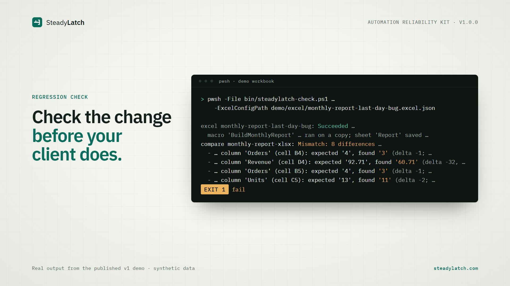
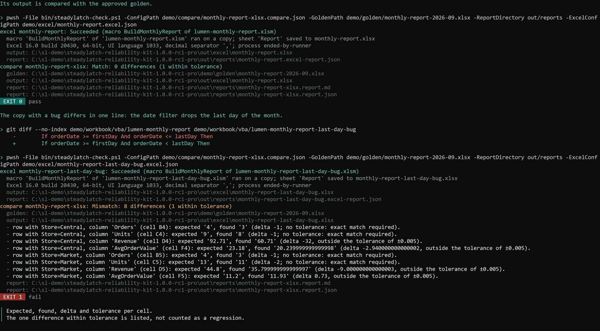
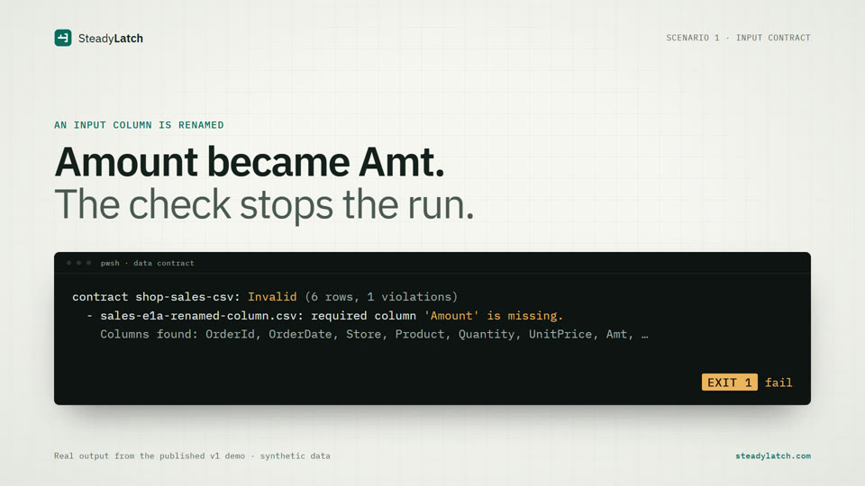
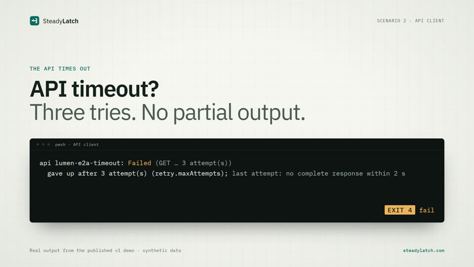
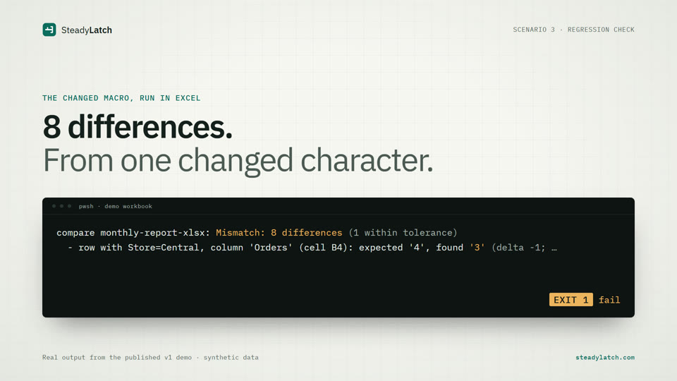
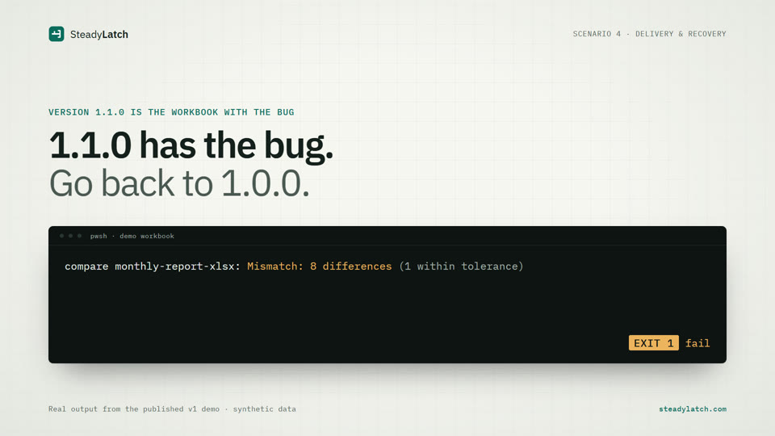

# Excel/VBA regression testing: a recorded demo

**Check a change before you deliver it.**

This repository shows what the **SteadyLatch Automation Reliability Kit v1.0.0** does when a change breaks an Excel/VBA automation: four scenarios, real commands and their real output. The data is synthetic: the sales of an invented shop, *Lumen & Leaf Stationery*.

There is no Kit code here, only the recorded demo, the text of a run and an explanation of each scenario.

[](https://steadylatch.com/#teaser)

*The 24-second teaser on [steadylatch.com](https://steadylatch.com/#teaser), with an AI-generated voice-over: one deleted character, and the Kit lists the cells that changed. Every terminal line in it comes from the recorded demo.*

[](https://steadylatch.com/#demo)

*Watch the demo on [steadylatch.com](https://steadylatch.com/#demo): about 4 minutes, no sound, captions on screen.*

## Who it is for

Freelancers and small studios who maintain Excel/VBA automations. An input column gets renamed, an API fails, a macro is edited or a new version is delivered, and a report that worked yesterday may now be wrong. The Kit checks for that before the change reaches your client.

## The four scenarios

| | What changes | What the Kit does | Where it runs |
|---|---|---|---|
| **E1** | An input column is renamed, or a required cell is empty | A data contract stops the bad input before the macro runs or anything is written. An empty cell is reported as empty, never as 0. | CI and locally |
| **E2** | The API fails | The client retries only what is worth retrying, within a time budget, never leaves a partial output, and network and contract problems get different exit codes. | CI and locally |
| **E3** | A macro changes | The output of the changed macro is compared cell by cell with an approved golden. The demo's bug, a date filter that drops the last day of the month, shows up as 8 differences. | The macro runs locally; the comparison also runs in CI |
| **E4** | A new version is delivered | The VBA is exported to text with an environment manifest, packed with the workbook and checksums, and the previous version is restored and checked with the runner and the golden. Pro and Consultant licenses only. | Locally; packaging and restore need no Excel |

### Scenario clips

One short clip per scenario on [steadylatch.com](https://steadylatch.com/#kit), 15 to 18 seconds each, with an AI-generated voice-over and music. Every terminal line in them comes from the recorded demo, some shortened with an ellipsis (…).

| | |
|---|---|
| [](https://steadylatch.com/#clip-e1) **E1** · input contract | [](https://steadylatch.com/#clip-e2) **E2** · API client |
| [](https://steadylatch.com/#clip-e3) **E3** · regression check | [](https://steadylatch.com/#clip-e4) **E4** · delivery and recovery |

Commands and output of each scenario: [docs/scenarios.md](docs/scenarios.md). The whole run as plain text: [demo/transcript.txt](demo/transcript.txt).

An excerpt of E3, the changed macro against the approved golden:

```text
compare monthly-report-xlsx: Mismatch: 8 differences (1 within tolerance)
  - row with Store=Central, column 'Orders' (cell B4): expected '4', found '3' (delta -1; no tolerance: exact match required).
  - row with Store=Central, column 'Revenue' (cell D4): expected '92.71', found '60.71' (delta -32, outside the tolerance of ±0.005).
  - row with Store=Market, column 'Units' (cell C5): expected '13', found '11' (delta -2; no tolerance: exact match required).
 EXIT 1  fail
```

## What the Kit is

A PowerShell kit that checks a change did not break existing results:

- **Data contracts** for CSV, JSON and the values of one sheet of an .xlsx/.xlsm file, read without Excel: columns, types, required and empty, row count.
- **Golden comparison** for CSV, JSON and .xlsx values, by position or key, with tolerances per column. A golden is never overwritten silently: approval is explicit.
- **A resilient API client**: GET with timeouts, bounded retries with backoff, the response checked against a contract and saved only when valid, the token from an environment variable and redacted from its log.
- **A local Excel runner** (Windows, Excel desktop, a person present) that runs a macro on a copy of the workbook with a time limit and saves the output only when everything worked.
- **One command-line entry point** for CI and local use, with stable [exit codes 0-5](docs/exit-codes.md).
- **Delivery tooling** (Pro and Consultant): VBA export and import as text, manifest checks, delivery packages, a recovery procedure and a GitHub Actions template.

Excel is only driven locally. The checks that do not need Excel run in CI without Office.

## Requirements and limits

- PowerShell 7.4 or later. Running macros and exporting or importing VBA need Windows with Excel desktop, with a person present, never in hosted CI.
- Tested with v1.0.0 on Windows 11 with Microsoft 365 Excel (64-bit) and PowerShell 7. The checks that do not need Excel are also tested on Linux (Ubuntu) in GitHub Actions. Not tested yet: Windows 10, 32-bit Excel, perpetual Office versions, other UI languages.
- Values only: no comparing formats, charts, pivot tables or formulas. No Excel for Mac, Excel on the web, Office Scripts, Google Sheets or .xls.

Everything it does not do, and the fixed limits: [docs/limits.md](docs/limits.md).

## Licenses

One-time purchase, VAT included: the price is the total. Each license covers one developer. Updates within version 1.x of the files your license includes are included. Full refund on request within 14 days of purchase.

| License | Price | Includes |
|---|---|---|
| Solo | €59 | Data contracts, golden comparison and approval, the API client, the local Excel runner, the VBA modules, the complete demo and the documentation. Not the delivery tooling. |
| Pro | €119 | Everything in Solo, plus the delivery tooling (scenario E4). |
| Consultant | €249 | The same files as Pro, and you may include them in work you deliver to your own clients. |

**[Buy the Pro license (€119)](https://buy.polar.sh/polar_cl_sGNAlOrFYTGuGtSaZNuuodyQMPnpCBrjJKFkL1tYh4p?utm_source=github&utm_medium=repo&utm_campaign=kit-v1&utm_content=demo-repo-readme)** · [Compare the licenses](https://steadylatch.com/#pricing) · [Terms](https://steadylatch.com/terms.html)

Polar is the merchant of record: it charges any VAT or sales tax and sends the invoice.

## About this repository

- The video and [demo/transcript.txt](demo/transcript.txt) were recorded on 3 October 2026 with release candidate 1.0.0-rc1 (Pro package) on Windows 11 with Microsoft 365 Excel. v1.0.0 only adds a documentation fix: no output in them changes. The transcript is another run of the same script, so ids and times differ from the video.
- Nothing here is the Kit: no module, scripts, contracts, workbooks or goldens. All data in the demo is synthetic.
- Text and images in this repository: [CC BY 4.0](LICENSE). The license does not cover the Kit, which is sold separately, or the SteadyLatch name. Microsoft, Excel and PowerShell are trademarks of Microsoft.
- Questions: [hello@steadylatch.com](mailto:hello@steadylatch.com) · Website: [steadylatch.com](https://steadylatch.com/)
